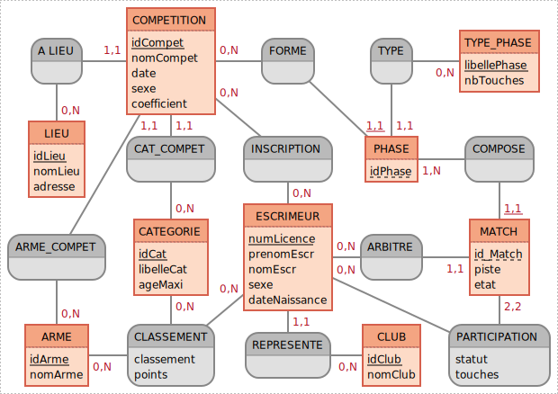

# Projet 2 : Gestion – Compétition Escrime
#### Titouan COULON, Noam DOUCET, Anthony GARDELLE, Arthur GOUDAL, Killian OUZET
---
## Mise en place de l'application
Pour lancer l'application, il vous suffit d'exécuter les commande s bash suivantes :
```
git clone https://github.com/coulontitouan/escrime.git
cd escrime
source start.sh (Linux)
.\start.ps1 (Windows)
```
Ensuite il vous suffit de cliquer sur `http://192.168.28.66:8080`
```
WARNING: This is a development server. Do not use it in a production deployment. Use a production WSGI server instead.
 * Running on all addresses (0.0.0.0)
 * Running on http://127.0.0.1:8080
 * Running on http://192.168.28.66:8080
Press CTRL+C to quit
```
Pour fermer l'application il suffit de faire la combinaison de touches CTRL+C dans le terminal

## Rapport Collectif

## Présentation du projet

### Contexte

Le contexte actuel est : lors de la gestion de compétitions d'escrime, les feuilles sont au format papier et les résultats et prochains matchs ne sont pas accessibles facilement par les personnes sur place.  
La répartition des poules et l'organisation des matchs est également faite à la main.    
Il faut donc créér une application permettant de créer et gérer des compétitions automatiquement ( répartition poules, matchs et résultats ) et renvoyer à partir de cette application les résultats et les classements nationaux actualisés après cette compétition.

### Cahier des charges
Avec l'objectif final de gérer plusieurs compétitions d'escrime, nous devions créer une application où l'on peut :
+ Créer des compétitions avec tous les attributs demandés et les 
afficher.
+ Permettre à des tireurs, des visiteurs, des arbitres et un ou plusieurs administrateurs d'accéder à l'application.
+ Inscrire à la compétition un nombre de « tireurs » ou « tireuses » non limité.
+ Inscrire des arbitres aux compétitions.
+ Répartir automatiquement les compétiteurs en poule de 5 à 9 participants, selon les règles de la fédération.
+ Répartir des poules où les matchs d’élimination sur les pistes disponibles.
+ Gérer des phases d’élimination directe après les phases de poule.
+ Éditer sur l'application des feuilles de match (feuille de score données aux arbitres).
+ Établir un classement provisoire (après les poules) et d’un classement final après les matchs d’élimination.
+ Afficher sur grand écran des classements et de l’arbre du tableau d’élimination et des résultats.

Spécifications techniques :
+ On considère qu’il existe une base de données régionale des escrimeurs qui
  pratiquent la compétition. Si un joueur s’inscrit pour la première fois à une
  compétition, l’application l’ajoutera à cette base.
+ L’application archivera les compétitions gérées par le club et mettra à jour les
  classements des compétiteurs. Attention, le classement à l’issue de la compétition
  n’est qu’un élément du classement à proprement parler d’un joueur. (Fusion avec
  des BD externe)
+ On considère qu'il existe 6 armes (fleuret homme, fleuret femme, épée homme, épée femme, sabre homme
et sabre femme) et 9 catégories (U13, U15, U17, U20, senior, V1, V2, V3, V4).

### Analyse

#### Le modèle conceptuel de données (MCD)



#### Le modèle logique de données (MLD)

- **ARME** (<ins>idArme</ins>, nomArme)
- **CATEGORIE** (<ins>idCat</ins>, libelleCat, ageMaxi)
- **CLASSEMENT** (<ins>_#numLicence_</ins>, <ins>_#idCat_</ins>, <ins>_#idArme_</ins>, classement, points)
- **CLUB** (<ins>idClub</ins>, nomClub)
- **COMPETITION** (<ins>idCompet</ins>, nomCompet, date, sexe, coefficient, _#idLieu_, _#idCat_, _#idArme_)
- **ESCRIMEUR** (<ins>numLicence</ins>, prenomEscr, nomEscr, sexe, dateNaissance, _#idClub_)
- **INSCRIPTION** (<ins>_#numLicence_</ins>, <ins>_#idCompet_</ins>)
- **LIEU** (<ins>idLieu</ins>, nomLieu, adresse)
- **MATCH** (<ins>_#idCompet_</ins>, <ins>_#idPhase_</ins>, <ins>id_Match</ins>, piste, etat, _#numLicence_)
- **PARTICIPATION** (<ins>_#numLicence_</ins>, <ins>_#idCompet_</ins>, <ins>_#idPhase_</ins>, <ins>_#id_Match_</ins>, statut, touches)
- **PHASE** (<ins>_#idCompet_</ins>, <ins>idPhase</ins>, _#libellePhase_)
- **TYPE_PHASE** (<ins>libellePhase</ins>, nbTouches)

#### Diagrammes  
<p><a href="docs/CEB_CasUtilisation.pdf">Diagramme de cas d'utilisation</a><br>
<a href="docs/FinDeMatch.pdf">Diagramme d'activité - Fin de match</a><br>
<a href="docs/InscriptionCompet.pdf">Diagramme d'activité - Inscription à une compétition</a></p>
Dans le dossier <strong>Scénarios</strong>, sont stockés les différents scénarios de l'application sous forme de .docx contenant le scénario nominal, alternatif et d'exception pour les fonctions principales. 

#### Rôles

# A COMPLETER AVANT FIN DU PROJET IAHGZIUVCSGVQ GGDVSGYGVCFIGYGYQVCFYYGFTYUHIVGGY8UHIOUGVGYUHIGVIYOUHIUG

#### Outils

Les outils que notre groupe a utilisé durant ce projet sont : 
- VSCode en tant qu'IDE
- GitHub pour partager les différentes avancées sur le code
- [MoCoDo](https://www.mocodo.net/) pour la conception de la base de données
- [Figma](https://www.figma.com/) pour la conception des maquettes de l'application

Notre utilisation de GitHub était de créer une branche pour chaque fonctionnalité et pour chaque merge, une vérification de plusieurs personnes du groupe pour éviter des erreurs, des pertes ou des répetitions.

#### Résultats 

# A COMPLETER AVANT FIN DU PROJET IAHGZIUVCSGVQ GGDVSGYGVCFIGYGYQVCFYYGFTYUHIVGGY8UHIOUGVGYUHIGVIYOUHIUG

---

# Rapport Individuel

## Titouan COULON

## Noam DOUCET

## Anthony GARDELLE

## Arthur GOUDAL

## Killian OUZET
